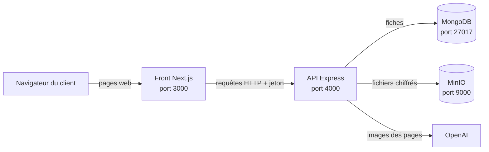
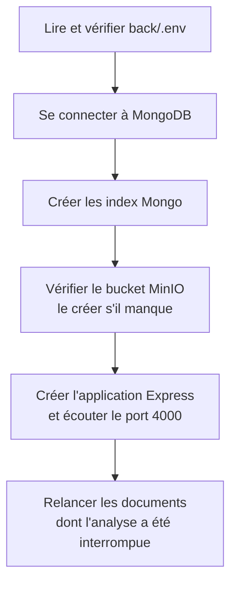
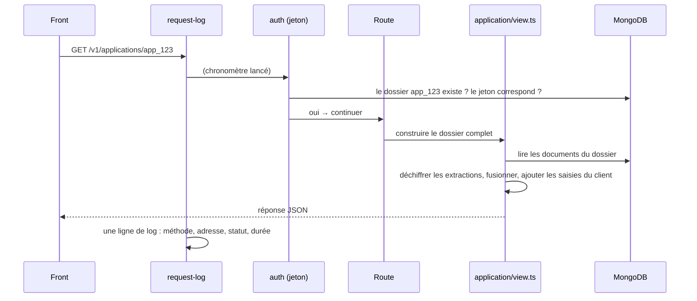
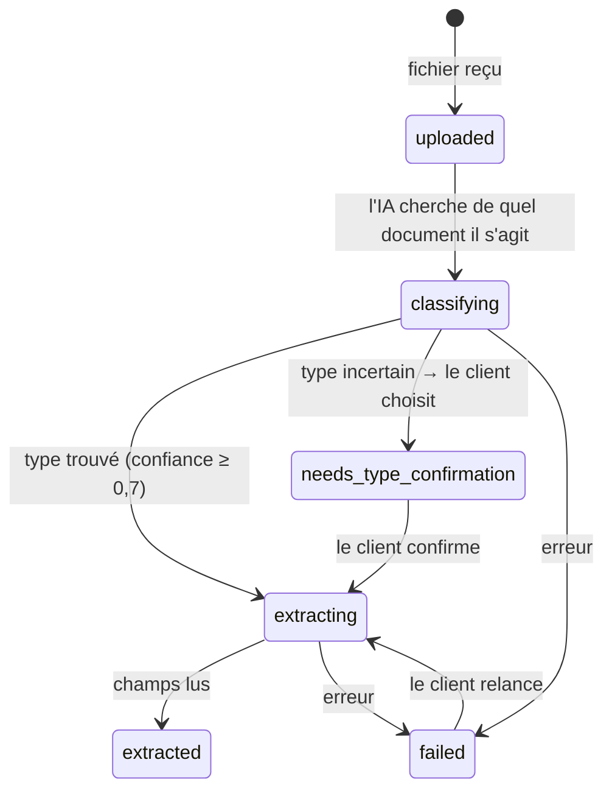
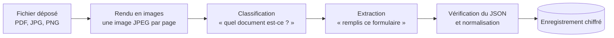
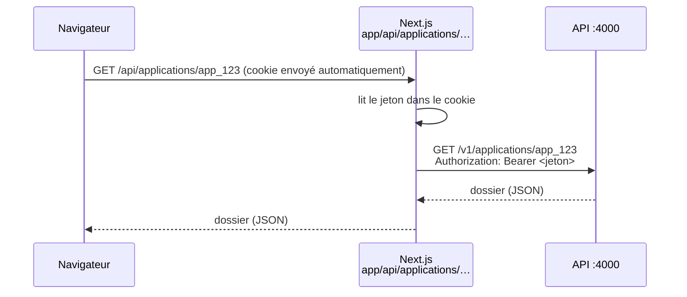

# Guide de formation — KYB Business

Ce guide explique **comment le projet fonctionne**, sans supposer que vous connaissez déjà Node, Express, MongoDB ou Next.js. Lisez-le dans l'ordre la première fois ; ensuite, la section [« Où regarder pour… »](#11-où-regarder-pour) sert d'aide-mémoire.

Pour les règles métier (ce qu'un dossier KYB doit contenir, les règles Bridge), la référence reste [`spec.md`](../spec.md).

---

## Sommaire

1. [À quoi sert le projet](#1-à-quoi-sert-le-projet)
2. [Vue d'ensemble : les pièces du puzzle](#2-vue-densemble--les-pièces-du-puzzle)
3. [Le dépôt et ses dossiers](#3-le-dépôt-et-ses-dossiers)
4. [Démarrer le projet en local](#4-démarrer-le-projet-en-local)
5. [Le backend (API Node + Express)](#5-le-backend-api-node--express)
6. [MongoDB : la base de données](#6-mongodb--la-base-de-données)
7. [MinIO : le stockage des fichiers](#7-minio--le-stockage-des-fichiers)
8. [L'IA : comment on parle à OpenAI](#8-lia--comment-on-parle-à-openai)
9. [Le frontend (Next.js)](#9-le-frontend-nextjs)
10. [Les tests](#10-les-tests)
11. [Où regarder pour…](#11-où-regarder-pour)
12. [Règles d'or à ne jamais casser](#12-règles-dor-à-ne-jamais-casser)
13. [Glossaire](#13-glossaire)

---

## 1. À quoi sert le projet

Une entreprise africaine veut ouvrir un compte chez **Bridge**. Bridge exige un dossier **KYB** (*Know Your Business*) : documents officiels de l'entreprise, identité des dirigeants et des associés, justificatifs…

Remplir ce dossier à la main est long et source d'erreurs. Notre application :

1. laisse le client **déposer ses documents** (RCCM, statuts, passeport…) ;
2. fait **lire ces documents par une IA** (OpenAI) pour en extraire les informations ;
3. **pré-remplit** le dossier et ne demande au client **que ce qui manque** ;
4. prépare le dossier au **format Bridge**.

---

## 2. Vue d'ensemble : les pièces du puzzle

Une analogie : imaginez une agence.

| Pièce | Rôle dans l'agence | Technologie |
| --- | --- | --- |
| **Le navigateur** | Le client, au guichet | Chrome, Edge… |
| **Le front** | Le guichet : ce que le client voit, les formulaires | Next.js (React) |
| **L'API (le back)** | Le bureau : vérifie, calcule, décide, range | Node.js + Express |
| **MongoDB** | Le classeur : les fiches des dossiers | Base de données |
| **MinIO** | La salle d'archives : les fichiers déposés, sous clé | Stockage de fichiers |
| **OpenAI** | L'expert externe qui lit les documents | Modèle d'IA (LLM) |



Point important : **le navigateur ne parle jamais directement à l'API**. Il passe toujours par le front, qui joue les intermédiaires (on verra pourquoi au [§9.3](#93-comment-le-front-parle-à-lapi)).

---

## 3. Le dépôt et ses dossiers

```
kyb-business/
├── back/              L'API (Node + Express + TypeScript)
├── front/             Le site web (Next.js)
├── packages/shared/   Le code partagé entre back et front (« @kyb/shared »)
├── fixtures/          Documents de test fictifs et réponses d'IA enregistrées
├── docs/              Ce guide
├── spec.md            La spécification fonctionnelle (la référence métier)
├── README.md          Présentation et commandes
└── CLAUDE.md          Notes d'avancement pour l'assistant de code
```

**Les « workspaces » npm.** Les trois dossiers `back`, `front` et `packages/shared` sont trois petits projets réunis dans un seul dépôt. Un seul `npm ci` à la racine installe tout. Pour lancer une commande dans l'un d'eux :

```bash
npm run dev --workspace=back
```

**Le code partagé (`packages/shared`)** contient ce dont le back *et* le front ont besoin : la forme des données (« schémas »), les listes de valeurs Bridge, les libellés en français. Ainsi, un email est validé **exactement de la même façon** dans le formulaire et dans l'API.

---

## 4. Démarrer le projet en local

Prérequis : Node.js 22+, MongoDB, MinIO (dans `C:\minio`), et un fichier `back/.env` (copie de `back/.env.example`, voir [§5.3](#53-la-configuration--le-fichier-env)).

Dans l'ordre, chacun dans son terminal :

```bash
# 1. MinIO (MongoDB tourne en service Windows)
C:\minio\minio.exe server C:\minio\data --license C:\minio\minio.license --console-address :9001

# 2. L'API, depuis la racine du projet
npm run dev --workspace=back

# 3. Le front, depuis la racine du projet
npm run dev --workspace=front
```

Puis ouvrez <http://localhost:3000>.

| Service | Adresse |
| --- | --- |
| Application | http://localhost:3000 |
| API (test de vie) | http://localhost:4000/health |
| Console MinIO | http://localhost:9001 |
| MongoDB (avec Compass) | `mongodb://localhost:27017`, base `kyb` |

---

## 5. Le backend (API Node + Express)

### 5.1 Node et Express en deux minutes

- **Node.js** permet d'exécuter du JavaScript (ici du **TypeScript**, du JavaScript avec des types) en dehors du navigateur, sur un serveur.
- **Express** est une petite bibliothèque pour créer une API web : on lui dit « quand quelqu'un demande telle adresse, exécute telle fonction ».

Trois notions suffisent :

| Notion | Explication | Exemple chez nous |
| --- | --- | --- |
| **Route** | Une adresse + une méthode HTTP (GET pour lire, POST pour créer, PATCH pour modifier, DELETE pour supprimer) | `GET /v1/applications/:id` lit un dossier |
| **Middleware** | Une fonction qui s'exécute *avant* la route, comme un contrôle à l'entrée | vérifier le jeton d'accès |
| **`req` / `res`** | La requête reçue / la réponse à renvoyer | `res.json(dossier)` |

Exemple réel, la route la plus simple du projet (`back/src/app.ts`) :

```ts
app.get("/health", (_req, res) => {
  res.json({ status: "ok" });
});
```

Et une vraie route avec un middleware de contrôle d'accès (`back/src/http/routes/applications.ts`) :

```ts
//                       adresse    contrôle d'accès           ce qu'on fait
applicationsRouter.get("/:id", requireApplicationAccess, async (req, res, next) => {
  try {
    res.json(await buildApplicationView(req.application!));
  } catch (error) {
    next(error); // passe l'erreur au gestionnaire d'erreurs
  }
});
```

### 5.2 Ce qui se passe au démarrage

Le point d'entrée est `back/src/index.ts`. Au lancement de `npm run dev --workspace=back` :



Si une étape échoue (MinIO éteint, `.env` incomplet…), l'API s'arrête et écrit `server.start_failed` dans le terminal, avec la cause.

### 5.3 La configuration : le fichier `.env`

Tout ce qui change d'une machine à l'autre (adresses, mots de passe, clés) est dans **`back/.env`**. Ce fichier **n'est jamais envoyé sur git** (il contient des secrets) ; son modèle est `back/.env.example`.

`back/src/config/env.ts` lit ce fichier au démarrage et **vérifie chaque valeur** : s'il manque la clé de chiffrement par exemple, l'API refuse de démarrer avec un message clair.

| Variable | À quoi elle sert |
| --- | --- |
| `PORT` | Port de l'API (4000) |
| `MONGO_URL` | Adresse de MongoDB et nom de la base (`kyb`) |
| `S3_ENDPOINT`, `S3_BUCKET`, `S3_ACCESS_KEY`, `S3_SECRET_KEY` | Adresse de MinIO, nom du « bucket » (dossier d'archives) et identifiants |
| `FILE_ENCRYPTION_KEY` | Clé qui chiffre les fichiers et les données extraites. **À ne jamais perdre** : sans elle, tout ce qui est stocké devient illisible |
| `OPENAI_API_KEY` | Clé pour appeler OpenAI |
| `LLM_MODE` | `live` (vrais appels), `record` (vrais appels + enregistrement), `replay` (rejoue des réponses enregistrées, sans réseau ni coût) |
| `LLM_MODEL_CLASSIFY`, `LLM_MODEL_EXTRACT`, `LLM_MODEL_GENERATE` | Modèles OpenAI utilisés (vide = valeurs par défaut) |
| `PDF_RENDER_DPI` | Résolution des images de pages envoyées à l'IA (200) |
| `MAX_FILE_BYTES`, `MAX_PAGES` | Limites d'un fichier : 15 Mo, 30 pages |
| `WEB_ORIGIN` | Adresse du front |
| `LOG_LEVEL` | Quantité de logs affichés (`info` par défaut) |

Dans le code, on n'utilise jamais `process.env` directement mais l'objet vérifié :

```ts
import { env } from "../config/env.js";
env.PORT; // 4000, déjà converti en nombre
```

### 5.4 Les dossiers de `back/src`

| Dossier / fichier | Rôle (en une phrase) |
| --- | --- |
| `index.ts` | Démarrage du serveur (voir §5.2) |
| `app.ts` | Assemble l'application Express : logs, routes, gestion des erreurs |
| `config/` | Lecture et vérification du `.env` |
| `http/routes/` | **Les routes** : `applications.ts` (dossiers, documents) et `ubos.ts` (personnes) |
| `http/middleware/` | Les contrôles : jeton d'accès (`auth.ts`), format des erreurs (`errors.ts`), une ligne de log par requête (`request-log.ts`) |
| `http/upload.ts` | Réception des fichiers envoyés (bibliothèque `multer`) |
| `db/` | **Tout ce qui parle à MongoDB** : connexion (`client.ts`), dossiers (`applications.ts`), documents (`documents.ts`) |
| `documents/` | **La vie d'un document** : contrôle du fichier, chiffrement et stockage MinIO, file d'attente, rendu en images, classification et extraction par l'IA |
| `documents/types/` | Un fichier par type de document lisible (RCCM, statuts, pièce d'identité) : ce qu'on demande à l'IA |
| `llm/` | **Le client OpenAI** (voir §8) |
| `application/` | **La fusion** : construire le dossier final à partir de tous les documents et des saisies du client |
| `rules/` | Les règles métier (seuil UBO de 25 %, rôles de direction…) |
| `eval/` | L'outil qui mesure la qualité de l'IA (`npm run eval`) |
| `logger.ts` | Les logs (bibliothèque `pino`), configurés pour ne **jamais** contenir de données personnelles |

### 5.5 Les routes de l'API

Toutes les adresses commencent par `/v1/applications` (« application » = un dossier KYB).

| Méthode | Adresse | Ce qu'elle fait |
| --- | --- | --- |
| `POST` | `/v1/applications` | Crée un dossier, renvoie son identifiant et un **jeton d'accès** |
| `GET` | `/v1/applications/:id` | Lit le dossier complet (champs fusionnés, personnes, documents, alertes) |
| `PATCH` | `/v1/applications/:id` | Enregistre les saisies du client (l'« autosave ») |
| `POST` | `/v1/applications/:id/documents` | Dépose un ou plusieurs fichiers |
| `GET` | `/v1/applications/:id/documents/:docId` | Lit un document et ses champs extraits |
| `PATCH` | `/v1/applications/:id/documents/:docId` | Confirme ou corrige le type d'un document (relance la lecture) |
| `DELETE` | `/v1/applications/:id/documents/:docId` | Supprime un document |
| `POST` | `/v1/applications/:id/ubos` | Ajoute une personne |
| `PATCH` | `/v1/applications/:id/ubos/:uboId` | Corrige une personne, rattache sa pièce d'identité, la désigne signataire |
| `DELETE` | `/v1/applications/:id/ubos/:uboId` | Retire une personne |

`:id` veut dire « remplacé par l'identifiant », par exemple `/v1/applications/app_80db…/documents`.

**Le jeton d'accès.** Il n'y a pas de compte utilisateur. À la création, l'API renvoie un jeton secret ; ensuite, **chaque requête doit le présenter** dans l'en-tête `Authorization: Bearer <jeton>`. Le middleware `requireApplicationAccess` le vérifie. En base, on ne garde que son empreinte (« hash ») : même quelqu'un qui lirait la base ne pourrait pas s'en servir.

**Les erreurs** ont toujours la même forme, ce qui permet au front d'afficher le bon message :

```json
{ "error": { "code": "FILE_TOO_LARGE", "message": "Le fichier dépasse 15 Mo.", "details": { "max_bytes": 15728640 } } }
```

### 5.6 Exemple : le trajet d'une requête

Que se passe-t-il quand le front demande `GET /v1/applications/app_123` ?



### 5.7 L'envoi d'un document et la file d'attente

Lire un document avec l'IA prend **10 à 40 secondes**. On ne fait donc pas attendre le client :

1. le fichier est **contrôlé** (vrai type lu dans le fichier, 15 Mo, 30 pages max), **chiffré** et rangé dans MinIO ;
2. l'API répond tout de suite **`202 Accepted`** (« reçu, je m'en occupe ») ;
3. le document part dans une **file d'attente** (`documents/queue.ts`, 3 documents traités en même temps) ;
4. le front **demande l'état du dossier toutes les 2 secondes** jusqu'à la fin.

Un document passe par ces **statuts** :



Si l'API s'arrête pendant une analyse, elle **reprend** les documents en cours au prochain démarrage.

---

## 6. MongoDB : la base de données

### 6.1 Le principe

MongoDB range des **documents JSON** dans des **collections** (l'équivalent des tables). Pas de tableaux rigides : chaque fiche est un objet JSON.

Notre base `kyb` contient deux collections :

| Collection | Une fiche = | Contenu principal |
| --- | --- | --- |
| `applications` | un dossier | statut (`draft`, `submitted`…), empreinte du jeton, **saisies du client** (`user_business`, `user_ubos`), dates |
| `documents` | un fichier déposé | nom, type, statut, page count, clé MinIO, **champs extraits chiffrés** (`extracted_data_enc`), coût des appels IA (`llm_usage`) |

> Dans Compass, `extracted_data_enc` n'est qu'une longue suite de caractères : c'est **normal**, les données extraites sont chiffrées. Pour les lire, passez par l'application.

### 6.2 La connexion

Un seul fichier ouvre la connexion : `back/src/db/client.ts`. Il est appelé une fois au démarrage, puis chaque fichier de `db/` réutilise la même connexion :

```ts
client = new MongoClient(env.MONGO_URL); // adresse lue dans .env
await client.connect();
db = client.db();                        // la base « kyb » (nom pris dans l'URL)
```

### 6.3 Les requêtes, avec de vrais exemples

On utilise le **driver officiel** MongoDB (pas d'ORM). Les requêtes sont regroupées dans `back/src/db/` : **aucune autre partie du code n'écrit de requête Mongo**.

**Créer** (`db/applications.ts`) :

```ts
await collection().insertOne({ _id: id, status: "draft", access_token_hash: hashToken(token), ... });
```

**Lire un élément** :

```ts
collection().findOne({ _id: id });
```

**Lire une liste triée** (`db/documents.ts`) :

```ts
collection().find({ application_id: applicationId }).sort({ uploaded_at: 1 }).toArray();
```

**Modifier un champ précis** (`$set`) — ici l'autosave d'un champ du client :

```ts
collection().updateOne({ _id: id }, { $set: { "user_business.email": { value, edited_at: now } } });
```

**Supprimer un champ** (`$unset`) — le bouton « Revenir à la valeur des documents » :

```ts
collection().updateOne({ _id: id }, { $unset: { "user_business.legal_name": "" } });
```

**Modifier seulement si…** — c'est l'astuce la plus importante. Le statut d'un document ne change **que s'il est encore dans l'état attendu** :

```ts
collection().findOneAndUpdate(
  { _id: id, status: { $in: ["classifying"] } }, // condition
  { $set: { status: "extracting" } },              // modification
);
```

Si entre-temps le client a supprimé le document, la condition échoue et rien n'est écrasé. C'est ce qui rend la file d'attente fiable.

---

## 7. MinIO : le stockage des fichiers

### 7.1 Le principe

MinIO est un **stockage de fichiers compatible avec Amazon S3**. On y range des fichiers (« objets ») dans un **bucket** (un grand dossier), chacun repéré par une **clé** (son chemin). Avantage : en production, on pourra utiliser le vrai S3 d'Amazon **sans changer une ligne de code**, seulement le `.env`.

Chez nous : bucket `kyb-documents`, clé `applications/<id du dossier>/<id du document>`.

### 7.2 Comment on s'en sert

Tout est dans `back/src/documents/storage.ts`, avec la bibliothèque officielle d'Amazon (`@aws-sdk/client-s3`) :

```ts
const s3 = new S3Client({
  endpoint: env.S3_ENDPOINT,            // http://localhost:9000 en local
  credentials: { accessKeyId: env.S3_ACCESS_KEY, secretAccessKey: env.S3_SECRET_KEY },
  forcePathStyle: true,                 // nécessaire pour MinIO
  region: env.S3_REGION,
});
```

Trois opérations, chacune une fonction :

| Fonction | Ce qu'elle fait |
| --- | --- |
| `putEncryptedObject(clé, contenu)` | **chiffre** le fichier puis l'envoie |
| `getDecryptedObject(clé)` | le récupère puis le **déchiffre** |
| `deleteObject(clé)` | le supprime |

### 7.3 Le chiffrement

Avant d'être envoyé à MinIO, chaque fichier est chiffré avec la clé `FILE_ENCRYPTION_KEY` (algorithme AES-256-GCM, dans `documents/encryption.ts`). Même quelqu'un qui accéderait à MinIO ne verrait que des données illisibles. Les **champs extraits** par l'IA sont chiffrés de la même façon dans Mongo.

---

## 8. L'IA : comment on parle à OpenAI

### 8.1 Le principe

OpenAI propose des modèles capables de **lire des images**. On leur envoie les pages d'un document sous forme d'images et on leur demande de remplir un **formulaire précis** (un JSON dont on impose la forme).



### 8.2 Les deux appels

**1. La classification** (`documents/classifier.ts`) : on envoie les **3 premières pages en petite résolution** et on demande « est-ce un RCCM, des statuts, une pièce d'identité… ? ». Réponse : un type et une confiance. Sous 0,7 de confiance, on demande au client de confirmer.

**2. L'extraction** (`documents/extractor.ts`) : on envoie **toutes les pages en bonne résolution**, avec des consignes propres au type (« la forme juridique se lit uniquement sur la mention *Forme juridique* »…). Réponse : chaque champ avec sa **valeur**, sa **confiance** (0 à 1) et sa **page source**.

Les consignes (« prompts ») sont en français, dans `back/src/documents/types/` :

| Fichier | Contenu |
| --- | --- |
| `prompts.ts` | Les règles communes (ne rien inventer, dates au format AAAA-MM-JJ, montants en entiers…) |
| `rccm.ts`, `statuts.ts`, `id-document.ts` | Les consignes propres à chaque type de document |
| `index.ts` | La liste des types que l'on sait lire |

### 8.3 Pourquoi l'IA répond toujours au bon format

On ne demande pas « réponds en JSON » en espérant que ça marche : on **impose** la forme exacte avec la fonction *Structured Outputs* d'OpenAI. Cette forme est générée automatiquement à partir des schémas du package partagé (`packages/shared/src/schemas/rccm.ts`…). À la réception, on **revérifie** la réponse ; si elle ne convient pas, on redemande **une seule fois** en expliquant l'erreur, sinon le document passe en échec.

### 8.4 Le client LLM

Tous les appels passent par un seul point : `back/src/llm/client.ts`. Il s'occupe :

- de **limiter** le nombre d'appels simultanés (5 maximum) ;
- de **réessayer** en cas de panne passagère (2 nouveaux essais, délai de 60 s) ;
- de demander à OpenAI de **ne pas conserver** nos données (`store: false`) ;
- de **mesurer** tokens, durée et coût de chaque appel (enregistrés sur le document, champ `llm_usage`) ;
- des **trois modes** de `LLM_MODE` :

| Mode | Usage |
| --- | --- |
| `live` | Fonctionnement normal : vrais appels à OpenAI |
| `record` | Vrais appels **et** enregistrement des réponses dans `fixtures/llm/` |
| `replay` | **Rejoue** les réponses enregistrées : aucun appel, aucun coût, aucune clé. Utilisé par **tous les tests** |

Les modèles par défaut : `gpt-4.1-mini` pour classer (rapide, peu cher), `gpt-4.1` pour extraire. Coût constaté : environ **0,01 $ par document**.

Pour vérifier que votre clé OpenAI fonctionne (un appel minuscule, moins de 0,001 $) :

```bash
npm run llm:check --workspace=back
```

### 8.5 Recette : ajouter un nouveau type de document

Exemple : rendre lisible le certificat fiscal (`tax_certificate`).

1. Le **schéma** existe déjà : `packages/shared/src/schemas/tax-certificate.ts`.
2. Créer `back/src/documents/types/tax-certificate.ts` sur le modèle de `rccm.ts` (consignes + schéma).
3. L'ajouter à la liste dans `back/src/documents/types/index.ts`.
4. Si ses champs doivent remplir le dossier, l'ajouter dans `back/src/application/merge.ts`.
5. Tester avec un document fictif, puis mesurer avec `npm run eval`.

---

## 9. Le frontend (Next.js)

### 9.1 Next.js en deux minutes

**React** permet de construire une page avec des **composants** (des briques réutilisables : un bouton, une carte de champ…). **Next.js** ajoute par-dessus le **routage** et un petit serveur.

La règle principale : **un dossier = une adresse**. Le fichier `page.tsx` d'un dossier est la page affichée à cette adresse.

```
front/src/app/
├── page.tsx                       →  /
└── dossier/[id]/
    ├── layout.tsx                 →  cadre commun à toutes les pages du dossier
    ├── documents/page.tsx         →  /dossier/app_123/documents
    ├── verifier/page.tsx          →  /dossier/app_123/verifier
    ├── completer/page.tsx         →  /dossier/app_123/completer
    └── recap/page.tsx             →  /dossier/app_123/recap
```

`[id]` entre crochets veut dire « partie variable de l'adresse » (l'identifiant du dossier).

Un fichier qui commence par `"use client"` s'exécute **dans le navigateur** (il peut réagir aux clics, à la saisie). Sans cette mention, il s'exécute sur le serveur.

> Attention : ce projet utilise **Next.js 16**, qui a des différences avec les versions plus anciennes que l'on trouve dans beaucoup de tutoriels. En cas de doute, la documentation à jour est dans `node_modules/next/dist/docs/` (voir `front/AGENTS.md`).

### 9.2 Les pages

| Adresse | Fichier | Ce que fait la page |
| --- | --- | --- |
| `/` | `app/page.tsx` | Accueil : documents à préparer, « Commencer mon dossier », « Reprendre » |
| `…/documents` | `app/dossier/[id]/documents/page.tsx` | Dépôt des fichiers, progression, statut de chaque document |
| `…/verifier` | `app/dossier/[id]/verifier/page.tsx` | Champs lus dans les documents, conflits à trancher, personnes |
| `…/completer` | `app/dossier/[id]/completer/page.tsx` | Questions au client (email, téléphone, chiffre d'affaires…) |
| `…/recap` | `app/dossier/[id]/recap/page.tsx` | Vue d'ensemble : pièces par section, personnes, points d'attention |

### 9.3 Comment le front parle à l'API

Le **jeton d'accès** du dossier est une donnée sensible. Pour qu'aucun script malveillant dans la page ne puisse le voler, il est rangé dans un **cookie `httpOnly`** : le navigateur l'envoie automatiquement, mais **le JavaScript de la page ne peut pas le lire**.

Conséquence : le navigateur ne peut pas ajouter lui-même le jeton aux requêtes vers l'API. Il passe donc par de petites routes serveur de Next.js (dossier `app/api/`), qui jouent les intermédiaires :



| Fichier | Rôle |
| --- | --- |
| `app/api/applications/route.ts` | Création d'un dossier : appelle l'API, **pose le cookie**, ne renvoie que l'identifiant |
| `app/api/applications/[id]/[[...path]]/route.ts` | **Relais** de toutes les autres requêtes (lecture, autosave, upload…) |
| `lib/server/backend.ts` | Adresse de l'API (`API_URL`, défaut `http://localhost:4000`) et nom du cookie |

### 9.4 Les fichiers de `front/src/lib`

| Fichier | Rôle |
| --- | --- |
| `api.ts` | Les fonctions qui appellent `/api/…` (créer un dossier, déposer un fichier avec suivi de la progression, corriger une personne…) |
| `queries.ts` | La couche **TanStack Query** (voir ci-dessous) |
| `autosave.ts` | L'**enregistrement automatique** des saisies |
| `labels.ts` | Les textes affichés (statuts, messages d'erreur, formats d'affichage) |
| `navigation.ts` | Les 4 étapes et leurs adresses |

**TanStack Query**, c'est la bibliothèque qui gère les données venues de l'API : elle les **garde en mémoire** (pas de rechargement inutile en changeant de page), les **rafraîchit** quand il faut et indique l'état (chargement, erreur…). Par exemple, la lecture du dossier interroge l'API **toutes les 2 secondes tant qu'un document est en cours d'analyse**, puis s'arrête :

```ts
useQuery({
  queryKey: ["application", id],
  queryFn: () => api.getApplication(id),
  refetchInterval: (query) => (query.state.data?.processing_documents ? 2000 : false),
});
```

### 9.5 L'autosave, pas à pas

Il n'y a pas de bouton « Enregistrer ». Quand le client tape son email :

1. chaque frappe met à jour le champ à l'écran ;
2. la valeur est **vérifiée** avec le schéma partagé (un email invalide n'est pas envoyé et un message s'affiche) ;
3. l'envoi attend **800 ms sans frappe** (pour ne pas envoyer une requête par lettre) ; plusieurs champs modifiés sont envoyés **ensemble** ;
4. `PATCH /v1/applications/:id` enregistre la valeur ;
5. l'API renvoie le dossier à jour, qui remplace celui en mémoire (ex. le téléphone revient normalisé en `+227…`) ;
6. en haut de page, l'indicateur passe de « Enregistrement… » à « Brouillon sauvegardé ».

### 9.6 Les composants principaux

| Composant | Rôle |
| --- | --- |
| `components/fields/FieldCard.tsx` | **Une carte de champ** : la valeur, sa source (« Extrait de : Extrait RCCM, p. 1 · 95 % »), les signalements (à vérifier, conflit), le choix entre valeurs en cas de conflit, le bouton « Revenir à la valeur des documents » |
| `components/dossier/UboCard.tsx` | **Une personne** (associé, dirigeant) et le formulaire d'ajout |
| `components/layout/DossierShell.tsx` | Charge le dossier pour toutes les pages `/dossier/…` et gère le cas « dossier inaccessible » |
| `components/layout/AppShell.tsx` | Le cadre : en-tête, étapes, indicateur d'enregistrement |
| `app/globals.css` | Tout le style visuel (couleurs, cartes, formulaires) |

---

## 10. Les tests

Aucun test n'appelle OpenAI : ils utilisent tous le mode `replay`.

| Commande | Ce qui est testé | Besoin de Mongo + MinIO ? |
| --- | --- | --- |
| `npm test --workspace=@kyb/shared` | Le code partagé (schémas, normalisations) | Non |
| `npm test --workspace=back` | Le back, pièce par pièce (fusion, règles, logs, IA rejouée…) | Non |
| `npm run test:smoke --workspace=back` | L'API complète, de la création du dossier à la suppression | Oui |
| `npm run test:e2e` | **Le parcours dans un vrai navigateur** (Playwright) | Oui |
| `npm run eval` | La **qualité de lecture de l'IA** sur `fixtures/` (vrais appels, payant) | Non |

Pour mesurer la qualité sur vos propres documents sans les publier : `fixtures/private/<nom>/` (ignoré par git) avec un fichier `expected.json`, voir [`fixtures/README.md`](../fixtures/README.md).

---

## 11. Où regarder pour…

| Je veux… | Fichier(s) |
| --- | --- |
| Ajouter une variable de configuration | `back/.env.example` + `back/src/config/env.ts` |
| Ajouter ou modifier une route de l'API | `back/src/http/routes/` |
| Écrire une requête Mongo | `back/src/db/` (et nulle part ailleurs) |
| Changer ce que l'IA doit lire sur un RCCM | `back/src/documents/types/rccm.ts` (puis relancer `npm run llm:record-samples --workspace=back`) |
| Ajouter un type de document lisible | Recette du [§8.5](#85-recette--ajouter-un-nouveau-type-de-document) |
| Changer la priorité entre documents (RCCM avant statuts…) | `back/src/application/merge.ts` |
| Changer les rôles de direction ou le seuil UBO | `back/src/rules/ownership.ts` |
| Ajouter un champ demandé au client | `packages/shared/src/schemas/application-view.ts` + `front/src/app/dossier/[id]/completer/page.tsx` |
| Changer un texte affiché | `front/src/lib/labels.ts` ou la page concernée |
| Changer l'apparence | `front/src/app/globals.css` |
| Comprendre une erreur au démarrage | Le log `server.start_failed` dans le terminal de l'API |

---

## 12. Règles d'or à ne jamais casser

1. **Aucune donnée personnelle dans les logs** (noms, dates de naissance, adresses, numéros…). On ne logge que des identifiants, des statuts, des codes et des durées. Un test le vérifie (`back/tests/logging.test.ts`).
2. **Une saisie du client n'est jamais écrasée** par une nouvelle lecture de document.
3. **La forme juridique se lit uniquement sur la mention « Forme juridique »**, jamais sur un « SARL » collé au nom (cas réel « SAIDOU AUTO »).
4. **Les dates sont stockées en `AAAA-MM-JJ`**, affichées en `JJ/MM/AAAA`. Un « 01/01 » n'est jamais « corrigé » : c'est fréquent sur les registres d'Afrique de l'Ouest.
5. **Les tests n'appellent jamais OpenAI** (`LLM_MODE=replay`).
6. **Ne jamais envoyer de secret sur git** : `back/.env` reste local. Et **ne jamais perdre `FILE_ENCRYPTION_KEY`**.

---

## 13. Glossaire

| Terme | Signification |
| --- | --- |
| **KYB** | *Know Your Business* : vérification de l'identité d'une entreprise avant d'ouvrir un compte |
| **Bridge** | Le partenaire chez qui le compte est ouvert ; il impose le format du dossier |
| **RCCM** | Registre du Commerce et du Crédit Mobilier : l'extrait officiel d'immatriculation d'une entreprise (zone OHADA) |
| **Statuts** | L'acte qui crée la société : forme, capital, associés, gérant |
| **UBO** | *Ultimate Beneficial Owner* : personne qui détient 25 % ou plus de l'entreprise |
| **Control person** | Personne qui dirige (gérant, PDG, DG…) |
| **API** | Le programme serveur qui reçoit des requêtes et renvoie des données (notre back) |
| **Route** | Une adresse de l'API associée à une action |
| **Middleware** | Fonction exécutée avant une route (contrôle d'accès, log…) |
| **JSON** | Format texte des données échangées : `{ "nom": "valeur" }` |
| **Schéma (Zod)** | La description de la forme attendue d'une donnée, qui sert aussi à la vérifier |
| **LLM** | *Large Language Model* : modèle d'IA comme ceux d'OpenAI |
| **Prompt** | Les consignes données à l'IA |
| **Token** | Unité de facturation d'OpenAI (un morceau de mot ou d'image) |
| **Bucket** | Grand dossier de stockage dans MinIO / S3 |
| **Hash (empreinte)** | Transformation à sens unique : permet de vérifier un secret sans le stocker |
| **Cookie `httpOnly`** | Cookie que le navigateur envoie au serveur mais que le JavaScript de la page ne peut pas lire |
| **Polling** | Interroger régulièrement le serveur pour savoir si quelque chose a changé |
| **Replay** | Rejouer des réponses d'IA enregistrées au lieu d'appeler OpenAI |
| **Fixtures** | Données de test (documents fictifs, réponses enregistrées) |
