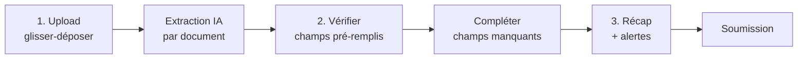
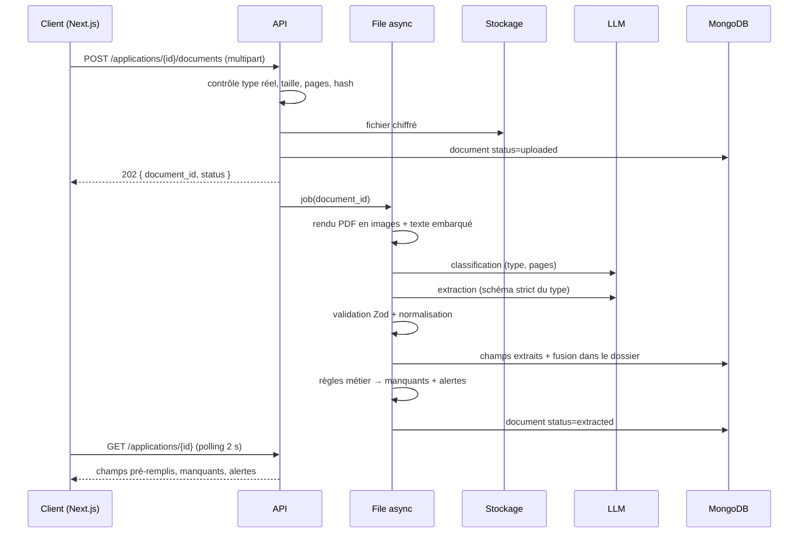

# Self-onboarding Business (KYB) assisté par IA

Sep 25, 2026 · @Abdoul

## Contexte et objectif

On construit un formulaire d'onboarding Business en self-service : le client charge ses documents, l'IA en extrait les données, et il ne complète que ce qui manque. La sortie est un dossier KYB prêt à soumettre à Bridge, sans ressaisie manuelle par l'équipe.

Aujourd'hui, le KYB repose sur deux checklists Word (client et interne) et un Guide KYB Bridge. Chaque dossier a demandé plusieurs allers-retours RFI avec Bridge. L'objectif est d'anticiper ces RFI dès la première saisie.

C'est un projet autonome (repo dédié, front + back), sans dépendance au monorepo Sako. Il sert aussi de projet d'onboarding pour les nouveaux ingénieurs : périmètre fermé, démo en fin de parcours, code réintégrable plus tard dans `api/` (même stack Node/TypeScript).


| Rôle | Personne                           | Responsabilité                                      |
| ---- | ---------------------------------- | --------------------------------------------------- |
| DRI  | @Abdoul                            | Priorités, règles métier KYB, validation des jalons |
| IC   | Nouvel ingénieur (nom à compléter) | Conception, code, tests, démo                       |


L'IC est encouragé à utiliser l'IA à chaque étape : cadrage, design, génération de code, tests, et dans le produit lui-même. Il documente dans le README où et comment il l'a utilisée.

## Parcours utilisateur

Trois écrans, dans cet ordre : charger, vérifier, soumettre. Aucune question n'est posée si la réponse est déjà dans un document.




1. **Upload.** Une seule zone de dépôt, multi-fichiers (PDF, JPG, PNG). L'IA classe chaque fichier (statuts, RCCM, pièce d'identité…) et lance l'extraction. Le client voit une barre de progression par document et peut en ajouter à tout moment.
2. **Vérifier et compléter.** Les champs extraits sont pré-remplis, avec leur source (« extrait de : Extrait RCCM ») et modifiables. Les champs vides ou à faible confiance sont surlignés. Seuls les champs manquants sont demandés, section par section.
3. **Récap.** Liste des pièces fournies par section Bridge, pièces manquantes, et alertes (voir Règles métier). Le client peut soumettre avec une pièce manquante seulement s'il saisit une explication écrite.

Le formulaire client est en français. L'export interne reprend les libellés Bridge en anglais, car Bridge fonctionne uniquement en anglais. Le brouillon est sauvegardé automatiquement pour reprendre plus tard.

## Documents et champs extraits par l'IA

Chaque document est rattaché à une seule section Bridge et alimente des champs précis. Un document ne sert jamais deux catégories (ex. carte professionnelle ≠ pièce d'identité).


| Document chargé                                                    | Section Bridge                          | Champs extraits                                                                                                |
| ------------------------------------------------------------------ | --------------------------------------- | -------------------------------------------------------------------------------------------------------------- |
| Statuts                                                            | Formation document + Ownership document | Legal business name, forme juridique, siège, objet social, capital, répartition des parts, gérant/dirigeants   |
| Extrait RCCM (ou registre local)                                   | Formation document                      | Legal business name, numéro RCCM, date d'immatriculation, pays, adresse, forme juridique, activité, dirigeants |
| Certificat modificatif RCCM                                        | Formation document                      | Nouvelle activité, date de modification                                                                        |
| Certificat fiscal (NIF, NINEA, IFU, TIN)                           | Formation document                      | Tax ID, nom, adresse                                                                                           |
| Registre des associés, PV d'AG, cap table, attestation signée      | Ownership document                      | Associés et % détenus                                                                                          |
| Passeport ou CNI                                                   | UBO Information                         | Nom complet, date de naissance, nationalité, adresse (si présente), date d'expiration                          |
| Quitus fiscal, attestation de non-faillite                         | Evidence of good standing               | Type, date d'émission, validité                                                                                |
| Facture eau/électricité, relevé bancaire, bail                     | Proof of address                        | Nom au document, adresse, date du document                                                                     |
| Factures, contrats clients                                         | Proof of business activity              | Émetteur, client, rôle de l'entreprise (fournisseur ou client), montant, date                                  |
| Agrément, licence, carte d'importateur, autorisation ministérielle | Proof of licensure                      | Autorité, type, numéro, validité                                                                               |
| Bail d'entrepôt, connaissements, contrats fournisseurs/logistiques | Additional documentation                | Parties, adresse, dates, marchandises                                                                          |


La section « EEA Required Information » est hors périmètre, car non applicable à la majorité des dossiers africains.

Les statuts sont la seule exception à la règle « une section par document » : ils couvrent à la fois Formation et Ownership, parce que Bridge les accepte pour les deux.

Chaque champ extrait est stocké avec sa valeur, le document source, la page et un score de confiance (0 à 1). En dessous de 0,8, le champ est signalé « à vérifier ».

## Champs à compléter par le client

Ces champs ne figurent jamais dans les documents : ils sont toujours demandés, en dernier, sur un seul écran court.


| Champ Bridge                        | Question au client                                    | Format / règle                                                                            |
| ----------------------------------- | ----------------------------------------------------- | ----------------------------------------------------------------------------------------- |
| Email address                       | Email professionnel suivi activement                  | Email valide                                                                              |
| Phone number                        | Téléphone professionnel                               | Format international                                                                      |
| Business website                    | Site web                                              | URL, ou case « pas de site » qui ouvre un champ : comment trouvez-vous vos clients ?      |
| Business description                | Votre activité en 2-3 phrases                         | Pré-rédigée par l'IA depuis l'objet social, éditable                                      |
| Primary source of funds             | Origine des fonds                                     | Owner's Capital ou Sales of Goods and Services                                            |
| Estimated annual revenue            | Chiffre d'affaires annuel estimé                      | USD, tranches Bridge (voir Annexe B)                                                      |
| Expected monthly transaction volume | Montant moyen mensuel sur le compte                   | USD                                                                                       |
| Money transmission                  | Transférez-vous des fonds pour le compte de clients ? | Oui/Non, Non par défaut. Si Oui : description du programme KYC/AML + agrément obligatoire |
| Intended account use                | À quoi servira le compte ?                            | Texte libre, toujours demandé                                                             |
| Business industry (NAICS)           | Aucune question                                       | Suggéré par l'IA, confirmé par le client                                                  |
| DAO status                          | Aucune question                                       | No par défaut                                                                             |


UBO et control persons : pour chaque personne détenant 25 % ou plus, ou ayant un rôle de direction (gérant, PDG, DG, PCA), l'IA pré-remplit depuis les statuts et la pièce d'identité. Le client complète seulement la fonction, le % et l'adresse personnelle actuelle si absents. Il peut ajouter autant de personnes que nécessaire.

## Règles métier (issues du Guide KYB Bridge)

Ces règles sont codées en dur côté back : l'IA extrait, les règles valident. Elles transforment les RFI observées en contrôles avant soumission.

**Forme juridique (Business entity type).** Lue sur la mention explicite « Forme juridique », jamais sur un sigle abrégé (cas SAIDOU AUTO). Mapping Annexe A :


| Forme locale                    | Bridge                                            |
| ------------------------------- | ------------------------------------------------- |
| SARL                            | LLC                                               |
| SA, SAS                         | Corporation                                       |
| Entreprise Individuelle         | Sole Proprietorship                               |
| SNC / SCS                       | General Partnership / Limited Partnership         |
| Association / Fondation / SCOOP | Nonprofit Organization / Foundation / Cooperative |


**Propriété.** Si les statuts ne donnent pas la répartition (cas OEX), demander un autre document de la liste Ownership, dans l'ordre. Sinon, générer une attestation de propriété à faire signer par le control person. Pour une entreprise individuelle, une lettre signée suffit.

**Identité.** Passeport ou CNI en cours de validité uniquement. Date de naissance toujours affichée et exportée en JJ/MM/AAAA. Une date « 01/01 » n'est jamais corrigée : c'est un artefact courant des registres ouest-africains.

**Adresse.** Facture ou relevé de 90 jours maximum, au nom de l'entreprise. Le bail commercial peut être plus ancien.

**Preuve d'activité.** Toujours demandée, en plus du site web. Un contrat où l'entreprise apparaît comme client (et non fournisseur) est rejeté avec un message explicite.

**Licence ou exemption.** Si l'activité touche services financiers, import/export de biens réglementés, santé, transport, télécoms ou assurance : licence exigée (ex. IMPM : carte d'importateur + autorisation ANRP / Ministère de la Santé). Sinon : l'IA rédige une explication d'exemption sur le modèle SAIDOU AUTO, en deux temps : (1) pourquoi l'activité n'est pas réglementée, avec le cadre légal, (2) les documents standards détenus (RCCM, numéro fiscal).

**Import/export, grossiste, distributeur.** Demander aussi bail d'entrepôt, connaissements et contrats fournisseurs/logistiques, ou une explication si indisponible.

**Transmission de fonds.** Non par défaut. Oui seulement si un agrément de transmission de fonds est fourni.

**NAICS.** Suggéré par l'IA à partir de l'objet social ou de la licence, jamais traduit depuis un code local. Le client choisit parmi les 3 codes les plus spécifiques proposés. Point de départ : les codes du Guide (522320, 541613, 423110, 423450…).

**Alertes non bloquantes** (affichées au récap, avec la pièce à anticiper) :

- Adresse du dirigeant ou du passeport dans un autre pays que l'entreprise (cas IMPM) : demander un justificatif de résidence actuelle.
- Nationalité du dirigeant ≠ pays d'immatriculation : prévoir un proof of address individuel.
- Codes d'activité différents entre RCCM, fiscal et sécurité sociale : demander une phrase d'explication.
- Capital symbolique ou apport en nature : normal, mentionné dans la source of funds, jamais bloquant.

**Blocage.** Une pièce manquante sans explication bloque la soumission. Ce n'est pas une alerte : c'est la seule règle qui empêche de passer au statut `ready`.


## Architecture technique

### Stack

Le front et le back sont deux applications séparées dans un même repo. Le stack est imposé pour que le code soit réintégrable dans `api/` Sako ; l'IC justifie dans le README les choix laissés libres (librairies, ORM, file d'attente).


| Couche            | Choix                                                                           | Pourquoi                                                                  |
| ----------------- | ------------------------------------------------------------------------------- | ------------------------------------------------------------------------- |
| Front             | Next.js (App Router), TypeScript, TanStack Query                                | Imposé                                                                    |
| API               | Node 20+, TypeScript strict, Express                                            | Même stack que `api/` Sako                                                |
| Validation        | Zod, partagé entre front et back (`packages/shared`)                            | Un seul schéma pour l'API, le formulaire et la sortie LLM                 |
| Base de données   | MongoDB (Mongoose ou driver natif)                                              | Même base que Sako ; un dossier = un document, pas de jointures           |
| Fichiers          | Stockage compatible S3 (MinIO en local, S3 en prod)                             | Même client que `s3Service` Sako                                          |
| LLM               | OpenAI (vision + PDF rendu en images), modèle configurable via `LLM_MODEL`      | Même fournisseur que `ExtractionService` Sako                             |
| Rendu PDF         | `pdfjs-dist` + `@napi-rs/canvas`                                                | Repris de `api/src/modules/sako/utils/pdfRenderer.ts`, sans dépendance système |
| Traitement async  | File en mémoire (`p-queue`, concurrence 3), statut persisté en base             | Suffisant pour le test ; BullMQ + Redis si le projet passe en prod        |
| Tests             | Vitest + Supertest                                                              | Rapide, TypeScript natif                                                  |
| Logs              | pino avec `redact`                                                              | Aucune donnée d'identité dans les logs                                    |


Le tout démarre avec `docker compose up` (mongo, minio, api, web). Aucun compte externe requis sauf la clé OpenAI.

### Structure du repo

```
kyb-onboarding/
├── apps/
│   ├── web/                       # Next.js
│   └── api/
│       └── src/
│           ├── server.ts
│           ├── config/env.ts                  # variables d'env validées par Zod
│           ├── http/
│           │   ├── routes/applications.ts
│           │   ├── routes/documents.ts
│           │   ├── middleware/auth.ts         # jeton de dossier
│           │   └── middleware/errors.ts
│           ├── documents/
│           │   ├── types/                     # un fichier par type de document
│           │   │   ├── index.ts               # registre
│           │   │   ├── rccm.ts
│           │   │   ├── statuts.ts
│           │   │   ├── id-document.ts
│           │   │   └── …
│           │   ├── pipeline.ts                # orchestration upload → extraction → fusion
│           │   ├── classifier.ts
│           │   ├── extractor.ts
│           │   ├── renderer.ts                # PDF/image → pages
│           │   └── storage.ts                 # S3 + chiffrement
│           ├── application/
│           │   ├── merge.ts                   # fusion des champs multi-documents
│           │   ├── ubo-matching.ts
│           │   ├── requirements.ts            # champs et pièces exigés par section
│           │   └── status.ts
│           ├── rules/                         # une règle = un fichier, fonctions pures
│           │   ├── index.ts
│           │   ├── entity-type.ts
│           │   ├── ownership.ts
│           │   ├── identity.ts
│           │   ├── proof-of-address.ts
│           │   ├── business-activity.ts
│           │   ├── licensure.ts
│           │   ├── logistics.ts
│           │   └── alerts.ts
│           ├── generation/                    # textes rédigés par l'IA
│           │   ├── description.ts
│           │   ├── naics.ts
│           │   ├── exemption.ts
│           │   └── attestation.ts             # PDF via pdf-lib, sans LLM
│           ├── export/bridge.ts
│           └── llm/client.ts
├── packages/shared/                           # schémas Zod + types partagés
├── fixtures/                                  # 4 dossiers du Guide + résultats attendus
├── scripts/eval.ts
└── docker-compose.yml
```

### Pipeline d'un document



L'upload est asynchrone : une extraction prend 10 à 40 s par document, trop long pour une requête HTTP bloquante. Le front interroge le dossier toutes les 2 s tant qu'un document est en cours (`uploaded`, `classifying`, `extracting`).

Statuts d'un document : `uploaded` → `classifying` → `extracting` → `extracted` | `needs_type_confirmation` | `failed`. Au démarrage de l'API, les jobs restés en `classifying` / `extracting` sont relancés.

**Étapes :**

1. **Contrôle du fichier.** Type détecté sur les octets (`file-type`), pas sur l'extension. PDF, JPG, PNG uniquement. 15 Mo et 30 pages max. Hash SHA-256 : un fichier déjà chargé dans le dossier renvoie le document existant.
2. **Stockage.** Chiffrement AES-256-GCM côté application avant envoi sur S3 (clé `FILE_ENCRYPTION_KEY`), en plus du chiffrement S3. Clé : `applications/{application_id}/{document_id}`.
3. **Rendu.** Reprise de `pdfToImagesAndText` : une image PNG par page et le texte embarqué du PDF, envoyé comme indice (comme `buildPdfTextHint` dans Sako). Résolution à 200 DPI par défaut (300 DPI multiplie le coût en tokens sans gain mesuré sur des scans de registre) ; configurable.
4. **Classification.** Un appel court, en `detail: low`, sur les 3 premières pages. Sortie : `{ type, confidence, page_ranges }`. Si la confiance est sous 0,7 ou le type est `unknown`, le document passe en `needs_type_confirmation` et le client choisit le type dans une liste.
5. **Segmentation.** Un scan unique contient souvent plusieurs pièces (statuts + RCCM + CNI). Si la classification renvoie plusieurs `page_ranges`, le fichier est découpé en sous-documents, chacun avec son type et sa section Bridge. Le fichier d'origine reste unique en stockage.
6. **Extraction.** Un appel par sous-document, avec le prompt du type et une sortie en Structured Outputs (`response_format: { type: "json_schema", strict: true }`) générée depuis le schéma Zod du type. C'est la différence principale avec `ExtractionService` Sako, qui utilise `json_object` et ne garantit pas le schéma.
7. **Validation.** Parse Zod. En cas d'échec, un seul nouvel essai avec l'erreur Zod dans le prompt, puis `failed` avec un message client (« Document illisible, merci de charger un scan plus net »).
8. **Normalisation.** Voir plus bas.
9. **Fusion et règles.** Les champs sont fusionnés dans le dossier, puis le moteur de règles recalcule pièces manquantes, alertes et `ready`.

### Registre des types de document

On reprend le registre de Sako (`document-types/index.ts`, `DocumentTypeDefinition`) en l'enrichissant :

```ts
export interface DocumentTypeDefinition<T extends z.ZodTypeAny = z.ZodTypeAny> {
  readonly slug: DocumentTypeSlug;
  readonly labelFr: string;
  readonly bridgeSections: BridgeSection[];
  readonly schema: T;
  getPrompt(): string;
  toApplicationPatch(data: z.infer<T>, docId: string): ApplicationPatch;
}
```


| Slug                   | Libellé client                                   | Section Bridge                       |
| ---------------------- | ------------------------------------------------ | ------------------------------------ |
| `statuts`              | Statuts                                          | `formation`, `ownership`             |
| `rccm`                 | Extrait RCCM / registre du commerce              | `formation`                          |
| `rccm_modificatif`     | Certificat modificatif RCCM                      | `formation`                          |
| `tax_certificate`      | Certificat fiscal (NIF, NINEA, IFU, TIN)         | `formation`                          |
| `ownership_document`   | Registre des associés, PV d'AG, cap table        | `ownership`                          |
| `id_document`          | Passeport ou CNI                                 | `ubo`                                |
| `good_standing`        | Quitus fiscal, attestation de non-faillite       | `good_standing`                      |
| `proof_of_address`     | Facture, relevé bancaire, bail                   | `proof_of_address`                   |
| `business_activity`    | Facture ou contrat client                        | `business_activity`                  |
| `license`              | Agrément, licence, autorisation                  | `licensure`                          |
| `logistics_document`   | Bail d'entrepôt, connaissement, contrat logistique | `additional`                       |
| `unknown`              | Autre                                            | aucune (confirmation client)         |


Forme d'un champ extrait, identique pour tous les types :

```ts
const extracted = <T extends z.ZodTypeAny>(value: T) =>
  z.object({
    value: value.nullable(),
    confidence: z.number().min(0).max(1),
    source_page: z.number().int().min(1).nullable(),
  });
```

Exemple de schéma (RCCM) :

```ts
export const RccmSchema = z.object({
  legal_name: extracted(z.string()),
  rccm_number: extracted(z.string()),
  registration_date: extracted(z.string()),
  country: extracted(z.string()),
  registered_address: extracted(z.string()),
  legal_form_explicit: extracted(z.string()),
  activity: extracted(z.string()),
  officers: z.array(
    z.object({
      full_name: extracted(z.string()),
      role: extracted(z.string()),
    })
  ),
});
```

`legal_form_explicit` contient uniquement le texte de la mention « Forme juridique ». Le sigle collé au nom (« SAIDOU AUTO SARL ») n'est jamais utilisé : c'est ce qui a causé la RFI SAIDOU AUTO.

Le prompt système reprend celui de Sako (null si absent, ne rien inventer, dates ISO en sortie LLM, montants entiers) avec deux ajouts : recopier les noms à l'identique (ponctuation, suffixes, majuscules), et renvoyer `source_page` pour chaque champ.

### Normalisation

Fonctions pures dans `packages/shared`, testées unitairement.


| Donnée               | Règle                                                                                              |
| -------------------- | -------------------------------------------------------------------------------------------------- |
| Dates                | Stockées en ISO `YYYY-MM-DD`. Affichées et exportées en `DD/MM/YYYY`. Un « 01/01 » n'est jamais modifié. |
| Forme juridique      | Mapping Annexe A sur `legal_form_explicit`. Pas de correspondance : champ vide, demandé au client. |
| Pays                 | ISO 3166-1 alpha-3 (`SEN`, `NER`, `CIV`…).                                                         |
| Téléphone            | E.164 via `libphonenumber-js`, pays de l'entreprise par défaut.                                    |
| Montants             | Entier + devise ISO 4217. `FCFA`/`CFA` → `XOF` ou `XAF` selon le pays.                             |
| Pourcentages         | Calculés depuis le nombre de parts si seul le nombre est donné.                                    |
| Noms                 | Stockés tels qu'extraits. Une version normalisée (sans accents, majuscules, mots triés) sert seulement au rapprochement. |


### Fusion des champs entre documents

Plusieurs documents alimentent souvent le même champ (dénomination dans les statuts et le RCCM). Chaque champ du dossier garde la valeur retenue et la liste des candidats :

```ts
type Field<T> = {
  value: T | null;
  confidence: number;
  source_doc_id: string | null;
  source_page: number | null;
  edited_by_user: boolean;
  candidates: Array<{ value: T; confidence: number; source_doc_id: string; source_page: number | null }>;
};
```

Règles de fusion :

1. Un champ modifié par le client (`edited_by_user: true`) n'est jamais écrasé par une extraction ultérieure.
2. Sinon, on applique une priorité de source par champ, puis la confiance la plus haute.
3. Si deux candidats diffèrent après normalisation, la confiance retenue est plafonnée à 0,5 et une alerte `field_conflict` est levée : le client tranche.
4. Supprimer un document retire ses candidats et relance la fusion.


| Champ                    | Priorité des sources                     |
| ------------------------ | ---------------------------------------- |
| Legal business name      | `rccm` > `statuts` > `tax_certificate`   |
| Business entity type     | `statuts` > `rccm`                       |
| Registration number      | `rccm` uniquement                        |
| Tax ID                   | `tax_certificate` > `rccm`               |
| Incorporation date       | `rccm` > `statuts`                       |
| Registered address       | `rccm` > `statuts` > `tax_certificate`   |
| Activité                 | `rccm_modificatif` (le plus récent) > `rccm` > `statuts` |
| Répartition du capital   | `ownership_document` > `statuts`         |


### Rapprochement des UBO

Les personnes viennent de trois sources : associés et gérant des statuts, dirigeants du RCCM, pièces d'identité. Elles sont fusionnées en une seule fiche par personne.

- Clé de rapprochement : nom normalisé (similarité Jaro-Winkler ≥ 0,92 sur les mots triés), confirmée par la date de naissance si elle existe des deux côtés.
- Un nom proche sous le seuil ne fusionne pas : il crée une alerte `ubo_possible_duplicate` que le client résout.
- Une personne est retenue comme UBO si elle détient 25 % ou plus, et comme control person si son rôle est gérant, PDG, DG, PCA ou équivalent (liste dans `rules/ownership.ts`).
- Chaque UBO ou control person doit avoir une pièce d'identité rattachée. Sinon : pièce manquante.
- Le control person qui signe l'attestation de propriété est désigné par le client (`attests_ownership: true`).

### Moteur de règles

Chaque règle est une fonction pure, sans appel réseau ni LLM, testée avec les fixtures des 4 dossiers :

```ts
type RuleResult = {
  code: RuleCode;
  severity: 'blocking' | 'warning' | 'info';
  section: BridgeSection;
  message_fr: string;
  message_en: string;
  required_document?: DocumentTypeSlug[];
  resolvable_by_explanation: boolean;
  subject?: { ubo_id?: string; document_id?: string; field?: string };
};

type Rule = (app: Application, ctx: RuleContext) => RuleResult[];
```

`RuleContext` contient la date du jour (injectée pour tester la règle des 90 jours) et les listes de référence (activités réglementées, rôles de direction, NAICS).


| Code                           | Règle métier                                           | Gravité                         |
| ------------------------------ | ------------------------------------------------------ | ------------------------------- |
| `entity_type_unmapped`         | Forme juridique absente ou hors Annexe A               | blocking                        |
| `ownership_missing`            | Répartition du capital introuvable                     | blocking, attestation proposée  |
| `ownership_incomplete`         | Somme des parts ≠ 100 % ou détenteur personne morale   | blocking                        |
| `ubo_id_missing`               | UBO / control person sans pièce d'identité             | blocking                        |
| `id_expired`                   | Pièce d'identité expirée                               | blocking                        |
| `poa_too_old`                  | Facture ou relevé de plus de 90 jours (bail exempté)   | blocking                        |
| `poa_name_mismatch`            | Nom sur le justificatif ≠ dénomination                 | warning                         |
| `business_activity_missing`    | Aucune preuve d'activité                               | blocking                        |
| `business_activity_wrong_role` | Contrat où l'entreprise est cliente                    | blocking, message explicite     |
| `license_required`             | Activité réglementée sans licence                      | blocking                        |
| `exemption_required`           | Activité non réglementée sans explication d'exemption  | blocking, texte généré          |
| `logistics_docs_missing`       | Import/export ou négoce sans pièces logistiques        | blocking, explication possible  |
| `money_transmission_unlicensed`| Transmission de fonds = Oui sans agrément              | blocking                        |
| `ubo_address_country_mismatch` | Adresse du dirigeant hors du pays de l'entreprise      | warning                         |
| `ubo_nationality_mismatch`     | Nationalité ≠ pays d'immatriculation                   | warning                         |
| `activity_code_mismatch`       | Codes d'activité différents entre documents            | warning, explication demandée   |
| `symbolic_capital`             | Capital symbolique ou apport en nature                 | info                            |
| `field_conflict`               | Deux documents donnent des valeurs différentes         | warning                         |
| `low_confidence_field`         | Champ requis sous 0,8 non validé par le client         | blocking                        |


Une règle `blocking` avec `resolvable_by_explanation: true` passe au vert dès qu'une explication est saisie pour sa section. Le dossier est `ready` quand il n'y a plus aucun résultat `blocking` non résolu et que tous les champs requis sont remplis.

La détection « activité réglementée » est faite par règle (mots-clés sur l'objet social et le code NAICS retenu), pas par le LLM. La liste est dans `rules/licensure.ts` et validée par le DRI en J1.

### Génération de texte par l'IA

Hors extraction, le LLM rédige trois textes. Chaque texte est un brouillon éditable, jamais envoyé sans relecture du client, et régénérable.


| Texte                     | Entrée                                                  | Contrainte                                                                                  |
| ------------------------- | ------------------------------------------------------- | ------------------------------------------------------------------------------------------- |
| Business description      | Objet social, activité RCCM, preuves d'activité         | Anglais, 2-3 phrases, sans superlatifs ni chiffres non présents dans les documents          |
| Suggestion NAICS          | Objet social, licence, description                      | Le LLM choisit parmi une liste fermée de candidats (NAICS 2022 local, présélection par mots-clés). Sortie : 3 codes + justification courte. Un code hors liste est rejeté. |
| Explication d'exemption   | Activité, pays, documents détenus                       | Modèle SAIDOU AUTO en deux parties. Cadre légal cité seulement s'il figure dans la base de référence fournie au prompt. |


L'attestation de propriété n'est pas générée par le LLM : c'est un PDF rempli depuis un modèle (`pdf-lib`) avec les données du dossier, à faire signer par le control person puis recharger comme `ownership_document`.

### Modèle de données

Deux collections principales. Les fichiers sont sur S3, jamais en base.

```ts
type Application = {
  _id: string;                          // "app_…"
  status: 'draft' | 'ready' | 'submitted';
  access_token_hash: string;
  business: {
    legal_name: Field<string>;
    entity_type: Field<BridgeEntityType>;
    legal_form_local: Field<string>;
    incorporation_date: Field<string>;
    registration_number: Field<string>;
    tax_id: Field<string>;
    country: Field<string>;
    registered_address: Field<Address>;
    operating_address: Field<Address>;
    activity: Field<string>;
    share_capital: Field<{ amount: number; currency: string }>;
    email: Field<string>;
    phone: Field<string>;
    website: Field<string>;
    no_website_explanation: Field<string>;
    description: Field<string>;
    naics: Field<string>;
    naics_suggestions: Array<{ code: string; label: string; reason: string }>;
    source_of_funds: Field<BridgeSourceOfFunds>;
    annual_revenue: Field<BridgeRevenueBand>;
    monthly_volume_usd: Field<number>;
    money_transmission: Field<boolean>;
    money_transmission_program: Field<string>;
    account_purpose: Field<string>;
    dao: Field<boolean>;
  };
  ubos: Array<{
    id: string;
    full_name: Field<string>;
    role: Field<string>;
    ownership_pct: Field<number>;
    is_ubo: boolean;
    is_control_person: boolean;
    attests_ownership: boolean;
    dob: Field<string>;
    nationality: Field<string>;
    address: Field<Address>;
    id_document_id: string | null;
    id_expiry: Field<string>;
  }>;
  explanations: Array<{ section: BridgeSection; rule_code?: RuleCode; text: string; generated: boolean }>;
  rule_results: RuleResult[];
  created_at: Date;
  updated_at: Date;
  submitted_at: Date | null;
};

type StoredDocument = {
  _id: string;                          // "doc_…"
  application_id: string;
  parent_document_id: string | null;    // sous-document issu d'une segmentation
  original_filename: string;
  mime_type: string;
  sha256: string;
  s3_key: string;
  page_count: number;
  page_range: [number, number] | null;
  type: DocumentTypeSlug | null;
  type_confidence: number | null;
  type_confirmed_by_user: boolean;
  bridge_sections: BridgeSection[];
  status: DocumentStatus;
  error_code: string | null;
  extraction: unknown;                  // sortie LLM validée, chiffrée au repos
  llm_usage: { model: string; input_tokens: number; output_tokens: number; duration_ms: number }[];
  uploaded_at: Date;
};
```

Les sorties LLM brutes sont conservées (chiffrées) pour le jeu d'évaluation et pour rejouer la fusion sans rappeler le LLM.

### API

Base : `/v1`. JSON partout sauf l'upload (multipart). Pas de comptes utilisateur : `POST /applications` renvoie un jeton d'accès opaque, stocké haché en base, envoyé ensuite en `Authorization: Bearer <token>`. Le front le garde en cookie `httpOnly` et le met dans le lien « reprendre plus tard ».


| Méthode  | Route                                               | Rôle                                                                     |
| -------- | --------------------------------------------------- | ------------------------------------------------------------------------ |
| `POST`   | `/applications`                                     | Crée un brouillon. Renvoie `{ application_id, access_token }`.           |
| `GET`    | `/applications/{id}`                                | Dossier complet : champs, UBO, documents, résultats des règles.          |
| `PATCH`  | `/applications/{id}`                                | Corrige ou complète des champs (voir format plus bas).                   |
| `POST`   | `/applications/{id}/documents`                      | Upload multipart (1 à 10 fichiers). `202` avec la liste des documents.   |
| `GET`    | `/applications/{id}/documents/{docId}`              | Statut et champs extraits d'un document.                                 |
| `PATCH`  | `/applications/{id}/documents/{docId}`              | Confirme ou corrige le type. Relance l'extraction.                       |
| `DELETE` | `/applications/{id}/documents/{docId}`              | Supprime le document et ses candidats, relance la fusion.                |
| `GET`    | `/applications/{id}/documents/{docId}/preview`      | URL signée de 5 min vers le fichier déchiffré.                           |
| `POST`   | `/applications/{id}/ubos`                           | Ajoute une personne.                                                     |
| `PATCH`  | `/applications/{id}/ubos/{uboId}`                   | Modifie une personne.                                                    |
| `DELETE` | `/applications/{id}/ubos/{uboId}`                   | Retire une personne.                                                     |
| `PUT`    | `/applications/{id}/explanations/{section}`         | Enregistre l'explication d'une section.                                  |
| `POST`   | `/applications/{id}/generate/description`           | Brouillon de Business description.                                       |
| `POST`   | `/applications/{id}/generate/naics`                 | 3 codes NAICS suggérés.                                                  |
| `POST`   | `/applications/{id}/generate/exemption`             | Brouillon d'explication d'exemption.                                     |
| `GET`    | `/applications/{id}/attestation.pdf`                | Attestation de propriété pré-remplie.                                    |
| `GET`    | `/applications/{id}/status`                         | Pièces fournies, manquantes, alertes, `ready`.                           |
| `POST`   | `/applications/{id}/submit`                         | `409` si non `ready`. Passe en `submitted`, verrouille le dossier.       |
| `GET`    | `/applications/{id}/export`                         | JSON au format Bridge (libellés anglais).                                |


**PATCH d'un dossier.** Le client envoie des valeurs brutes ; le back les enveloppe en `Field` avec `edited_by_user: true`, `confidence: 1`, puis relance les règles. Le front l'appelle en autosave (debounce 800 ms).

```json
{
  "business": {
    "website": null,
    "no_website_explanation": "Nos clients nous trouvent via WhatsApp et le bouche-à-oreille.",
    "source_of_funds": "Sales of Goods and Services"
  }
}
```

**Statut.**

```json
{
  "status": "draft",
  "ready": false,
  "sections": [
    {
      "section": "formation",
      "label_fr": "Documents de constitution",
      "provided": [{ "document_id": "doc_1", "type": "rccm" }],
      "missing": [],
      "state": "complete"
    },
    {
      "section": "licensure",
      "label_fr": "Licence ou exemption",
      "provided": [],
      "missing": [{ "code": "exemption_required", "message_fr": "Expliquez pourquoi votre activité n'exige pas de licence.", "resolvable_by_explanation": true }],
      "state": "missing"
    }
  ],
  "missing_fields": ["business.email", "business.account_purpose", "ubos.ubo_2.address"],
  "low_confidence_fields": ["business.incorporation_date"],
  "alerts": [
    { "code": "ubo_address_country_mismatch", "severity": "warning", "message_fr": "L'adresse du passeport de M. X est en France : prévoyez un justificatif de résidence actuelle." }
  ],
  "processing_documents": 0
}
```

**Erreurs.** Format unique, codes stables utilisés par le front pour les messages :

```json
{ "error": { "code": "FILE_TOO_LARGE", "message": "Le fichier dépasse 15 Mo.", "details": { "max_bytes": 15728640 } } }
```

Codes : `VALIDATION_ERROR` (400), `UNAUTHORIZED` (401), `NOT_FOUND` (404), `APPLICATION_LOCKED` (409), `NOT_READY` (409), `UNSUPPORTED_FILE_TYPE` (415), `FILE_TOO_LARGE` (413), `TOO_MANY_PAGES` (413), `RATE_LIMITED` (429), `LLM_UNAVAILABLE` (503).

### Export Bridge

L'export suit l'ordre des écrans Bridge et utilise leurs libellés et valeurs de liste à l'identique (Annexe B). Il sert à remplir le formulaire Bridge à la main ; la soumission par API reste hors périmètre.

```json
{
  "business": {
    "Business legal name": "SAIDOU AUTO SARL",
    "Business entity type": "Limited Liability Company (LLC)",
    "Incorporation date": "14/03/2019",
    "DBA name / trade name": null,
    "Email address": "contact@example.com",
    "Phone number": "+22790000000",
    "Business website": null,
    "No website explanation": "…",
    "Business registration number": "NE-NIM-01-2019-B12-00123",
    "Registered address": { "street": "…", "city": "Niamey", "country": "NER" },
    "Principal operating address": { "street": "…", "city": "Niamey", "country": "NER" },
    "Tax identification number": "…",
    "Business description": "…",
    "Business industry (NAICS)": "423110",
    "Primary account purpose": "…",
    "DAO status": "No"
  },
  "source_of_funds": {
    "Primary source of funds": "Sales of Goods and Services",
    "Source of funds description": "…",
    "Estimated annual revenue (USD)": "$100,000 – $999,999 USD",
    "Money transmission on behalf of customers": "Not applicable. We will only move internal funds",
    "Expected monthly transaction volume (USD)": 25000
  },
  "associated_persons": [
    {
      "Full name": "…",
      "Title": "Managing Director",
      "Ownership percentage": 60,
      "Has control": true,
      "Attests ownership structure": true,
      "Date of birth": "01/01/1980",
      "Nationality": "NER",
      "Residential address": { "…": "…" }
    }
  ],
  "documents": [
    { "Bridge section": "Formation document", "File": "rccm.pdf", "Document type": "RCCM extract" }
  ],
  "explanations": [
    { "Bridge section": "Proof of licensure", "Text": "…" }
  ],
  "warnings": ["…"]
}
```

### Appels LLM

- Client unique dans `llm/client.ts` : timeout 60 s, 2 nouveaux essais avec backoff sur 429/5xx, sémaphore global (5 appels simultanés max).
- Modèles configurables séparément : `LLM_MODEL_CLASSIFY` (petit modèle), `LLM_MODEL_EXTRACT` (modèle vision principal), `LLM_MODEL_GENERATE`.
- `temperature: 0` pour la classification et l'extraction.
- `store: false` sur chaque appel ; l'API OpenAI n'entraîne pas sur les données API par défaut, à rappeler dans le README.
- Tokens, durée et coût enregistrés par document (`llm_usage`). Cible : moins de 0,15 USD et 30 s par document de 5 pages.
- Mode `LLM_MODE=replay` : les réponses enregistrées dans `fixtures/` sont rejouées. Les tests et la CI n'appellent jamais le vrai LLM.

### Sécurité

- Fichiers et sorties d'extraction chiffrés au repos (AES-256-GCM applicatif + chiffrement S3).
- Aucune donnée d'identité dans les logs : pino `redact` sur les champs du dossier, logs limités aux identifiants (`application_id`, `document_id`), types, statuts et durées. L'`ExtractionService` Sako logge l'URI S3 : ici on ne logge que l'id du document.
- Jeton d'accès de 32 octets aléatoires, haché (SHA-256) en base, expiration 30 jours.
- Rate limit : 60 requêtes/min par jeton, 30 uploads/heure par dossier, 10 créations de dossier/heure par IP.
- Dossier `submitted` en lecture seule.
- Suppression d'un dossier = suppression des fichiers S3 et des sorties LLM.
- CORS limité à l'origine du front.

### Évaluation et tests

- **Jeu d'évaluation.** `fixtures/<dossier>/` contient les documents anonymisés et un `expected.json` (type attendu par fichier, valeurs attendues par champ). `npm run eval` exécute le pipeline réel et affiche, par type de document : exactitude de la classification, taux de champs corrects, taux de faux positifs (champ rempli alors qu'il devait être vide). C'est ce script qui mesure le critère « 80 % des champs ».
- **Unitaires** (Vitest) : normalisation, mapping des formes juridiques, fusion, rapprochement UBO, chaque règle métier avec un cas passant et un cas bloquant.
- **Intégration** (Supertest, `LLM_MODE=replay`, Mongo et MinIO de test) : parcours complet sur SAIDOU AUTO, de la création du dossier à l'export.
- **Front** : un test Playwright du parcours heureux.

### Variables d'environnement

```
PORT=4000
MONGO_URL=mongodb://localhost:27017/kyb
S3_ENDPOINT=http://localhost:9000
S3_BUCKET=kyb-documents
S3_ACCESS_KEY=
S3_SECRET_KEY=
FILE_ENCRYPTION_KEY=            # 32 octets en base64
OPENAI_API_KEY=
LLM_MODE=live                   # live | replay | record
LLM_MODEL_CLASSIFY=
LLM_MODEL_EXTRACT=
LLM_MODEL_GENERATE=
PDF_RENDER_DPI=200
MAX_FILE_BYTES=15728640
MAX_PAGES=30
WEB_ORIGIN=http://localhost:3000
```

### Front (Next.js)

Le front consomme uniquement l'API ci-dessus, sans logique métier propre : il affiche ce que renvoient `GET /applications/{id}` et `/status`.

- Routes : `/` (démarrer), `/dossier/[id]/documents`, `/dossier/[id]/verifier`, `/dossier/[id]/completer`, `/dossier/[id]/recap`.
- Types et schémas Zod importés de `packages/shared` : le formulaire valide avec les mêmes règles que le back.
- Chaque champ affiche sa source (« extrait de : Extrait RCCM, p. 1 ») avec un lien vers l'aperçu du document, et un surlignage si `confidence < 0.8` ou en conflit.
- Upload avec progression réseau par fichier, puis progression d'extraction par polling.

## Critères d'acceptation et jalons

Le projet est réussi si un dossier type SAIDOU AUTO passe de l'upload à l'export Bridge en moins de 10 minutes, sans ressaisie d'un champ présent dans les documents.

**Critères d'acceptation :**

- [ ] Upload multi-fichiers avec classification automatique correcte sur les 4 dossiers de test.
- [ ] Au moins 80 % des champs extractibles pré-remplis correctement sur le jeu de test, mesuré par `npm run eval`.
- [ ] Seuls les champs manquants ou à faible confiance sont demandés au client.
- [ ] Forme juridique mappée correctement (SARL → LLC, SA → Corporation, EI → Sole Proprietorship), lue sur la mention « Forme juridique ».
- [ ] Dates de naissance exportées en JJ/MM/AAAA, « 01/01 » conservé tel quel.
- [ ] Contrat où l'entreprise est client détecté et signalé.
- [ ] Explication d'exemption générée pour une activité non réglementée ; licence exigée pour IMPM.
- [ ] Alerte d'adresse multi-pays déclenchée sur le dossier IMPM.
- [ ] Répartition absente des statuts (OEX) : document Ownership demandé, attestation pré-remplie proposée.
- [ ] Une modification du client n'est jamais écrasée par une extraction ultérieure.
- [ ] Aucune donnée d'identité dans les logs (vérifié par un test sur la sortie pino).
- [ ] Export JSON conforme aux libellés Bridge.
- [ ] Tests unitaires et d'intégration verts sans clé OpenAI (`LLM_MODE=replay`).
- [ ] `docker compose up` démarre le projet complet.
- [ ] README : choix techniques et usage de l'IA dans le développement.


| Jalon | Contenu                                                                                                  | Livrable                              |
| ----- | -------------------------------------------------------------------------------------------------------- | ------------------------------------- |
| J1    | Cadrage avec le DRI, repo + docker compose, schémas Zod par type de document, liste des activités réglementées | Schémas validés, squelette qui démarre |
| J2    | Upload async, stockage chiffré, classification, extraction sur 3 types (RCCM, statuts, passeport), `npm run eval` | Démo API + premier score d'éval       |
| J3    | Fusion, rapprochement UBO, écran de vérification / complétion, champs client, autosave                    | Démo front                            |
| J4    | Types de documents restants, segmentation, moteur de règles, alertes, exemption, NAICS, attestation      | Tests sur les 4 dossiers              |
| J5    | Récap, export Bridge, durcissement sécurité, README, démo finale                                         | Démo au DRI                           |


**Hors périmètre :** soumission directe via l'API Bridge, section EEA, KYC individuel (liveness), back-office interne, multilingue au-delà du français, comptes utilisateur et email de reprise, antivirus sur les fichiers.

**Questions ouvertes :**

- [ ] Durée du test : 3 jours ou 3 demi-journées ? Sur 3 demi-journées, retirer la segmentation et la génération d'attestation.
- [ ] Jeu de test : documents réels anonymisés ou générés ?
- [x] Stack : Next.js en front, Node/TypeScript/Express en back (imposés). Librairies secondaires libres, justifiées dans le README.
- [ ] Liste des activités réglementées et cadre légal par pays pour l'exemption : à fournir par le DRI en J1.
- [ ] Qui fournit la clé OpenAI et le budget de l'IC pour l'éval ?

## Annexe B — Valeurs de liste Bridge

À utiliser à l'identique dans le formulaire et l'export.

**Business entity type :** Sole Proprietorship · General Partnership (GP) · Limited Partnership (LP) · Limited Liability Partnership (LLP) · Corporation · Limited Liability Company (LLC) · Trust · Cooperative · Nonprofit Organization · Foundation · DAO

**Primary source of funds :** Business Loans · Grants · Inter-Company Funds · Investment Proceeds · Legal Settlement · Owner's Capital · Pension / Retirement · Sale of Assets · Sales of Goods and Services · Third Party Funds · Treasury Reserves. Le formulaire client ne propose que Owner's Capital et Sales of Goods and Services ; les autres valeurs restent acceptées par l'API pour les cas traités par l'équipe.

**Estimated annual revenue (USD) :** $0 – $99,999 USD · $100,000 – $999,999 USD · $1 million – $9 million USD · $10 million – $49 million USD · $50 million – $249 million USD · >$250 million USD

**Money transmission on behalf of customers :** Yes (explain below) · Not applicable. We will only move internal funds

## Annexe C — Réutilisation du code Sako

| Élément Sako                                             | Reprise dans le projet                                                                 |
| -------------------------------------------------------- | -------------------------------------------------------------------------------------- |
| `api/src/modules/sako/utils/pdfRenderer.ts`              | Copié tel quel dans `documents/renderer.ts`, DPI rendu configurable                    |
| `ExtractionService` : prompt système, indice texte PDF, images par page | Base de `documents/extractor.ts`                                        |
| `ExtractionService` : `response_format: json_object`     | Remplacé par `json_schema` strict généré depuis Zod, avec validation et nouvel essai   |
| `ExtractionService` : confiance globale + par champ      | Remplacé par `{ value, confidence, source_page }` sur chaque champ                     |
| `document-types/` (`DocumentTypeDefinition`, registre)   | Étendu avec `schema`, `bridgeSections`, `toApplicationPatch`                           |
| `document-types/nita.ts`                                 | Modèle de prompt à suivre : règles explicites, exemples label → champ, cas interdits   |
